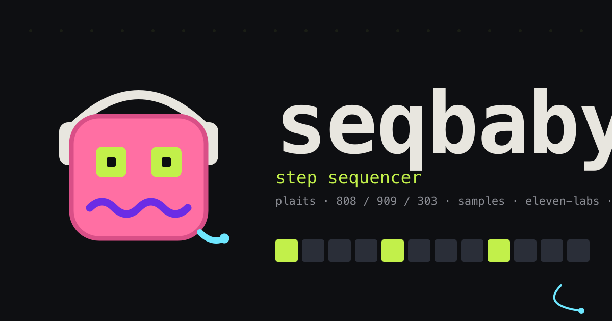

# seqbaby

<p align="center">
  
</p>

A multi-engine step sequencer that runs entirely in the browser. No installs, no
plugins — open a tab and build a track from synthesis engines, drum machines,
analog-mono emulations, wavetables, samples, and live Web MIDI, then save it to
your account or share the whole session as a single link.

**Live demo:** https://seqbaby.netlify.app · **Repo:** https://github.com/mjoslyn/seqbaby

---

## What it is

seqbaby is a 32-pattern step sequencer with a deep per-track signal chain. Each
track can drive any of 40+ sound sources and carries its own filter, envelope,
EQ, compressor, multi-effect rack, and LFO modulation matrix. Patterns play in
repeat or chain into songs, can be recorded to WAV in the browser, played live
from the computer keyboard, and saved to a Supabase-backed account or shared via
a generated URL.

The audio engine is hand-written, dependency-free vanilla JavaScript talking
directly to the Web Audio API — the original goal was to see how far the raw
graph and plain ES modules go before a framework earns its place. That engine
(~35 modules, no bundler) is now wrapped in a thin **Next.js + React** shell that
owns routing, authentication, and account/data features, while the sound
generation stays pure Web Audio.

## Highlights for the curious

- **Real synthesis, in the browser.** Integrates a WebAssembly port of Mutable
  Instruments' *Plaits* oscillator (16 synthesis models) alongside Tone.js
  drum/synth recipes (808/909 kits, a 303-style mono, FM bell, poly saw, pad).
- **Hand-built analog emulations.** Seven mono/poly voices modeled from the
  ground up in the Web Audio graph — MiniBrute, Minimoog, Juno-60, electric
  guitar, electric bass, Rhodes, and Prophet-6 — each with period-appropriate
  quirks (Brute Factor distortion, 3-oscillator Moog tuning with octave/range
  selects, the Juno's baked-in chorus, Karplus-Strong plucked strings).
- **Wavetable, granular, and sampler engines.** An AKWF wavetable engine with an
  in-app wavetable editor, a granular "texture" engine, and a unified sampler
  that plays bundled drum kits or your own uploads (persisted with the session),
  with a per-step region / fade / loop / ping-pong editor.
- **A full mixing channel per track.** Native `BiquadFilterNode` with an ADSR
  filter envelope, 3-band EQ, a compressor that can self-compress *or* sidechain
  off any other track's output, and an ordered FX rack (asymmetric fuzz →
  bitcrusher → feedback delay → reverb).
- **Modulation matrix.** Per-track LFOs route to engine-internal parameters
  (oscillator detune, PWM rate, filter cutoff, FX sends) with sync-to-tempo and
  free-rate modes. Available targets are gated per engine so the UI only offers
  what actually patches.
- **Expressive step editing.** Per-step note, chord (scale-filtered), arpeggiator
  (rate/range/direction), ratchet, velocity, micro-timing offset, and complexity,
  in a step editor or a piano-roll view. Vertical drag on a step transposes it,
  scale-aware.
- **Play it from the keyboard.** A computer-keyboard performance mode (Ableton-
  style layout, scale mapping, chord mode) is always live on desktop — plus live
  recording onto the playing pattern and retroactive Capture of the last phrase.
- **Web MIDI in and out.** Drive external gear from a track, or capture incoming
  MIDI into a pattern.
- **In-browser bounce.** Records the live master output via `MediaRecorder`,
  decodes it, and encodes 16-bit PCM WAV by hand (RIFF header + interleaved
  int16) — pattern or full chained song.
- **Accounts and sharing.** Sign in to save songs to the cloud, publish a song as
  a public `?s=<slug>` link, publish patches to a gallery, and get a public
  profile page at `/u/<name>` that others can fork from. Anonymous share links
  and quick JSON export/import work without an account.

## Tech stack

| Layer | Choice | Why |
|---|---|---|
| Shell / routing / auth | Next.js 15 (App Router) + React 19 | SSRs the engine's DOM, owns auth, account UI, and server actions |
| Audio engine | Vanilla ES modules + Web Audio API + Tone.js 15 | Hand-written audio graph on the hot path; no bundler, booted client-side |
| Synthesis | `@vectorsize/woscillators` (Plaits WASM) | Authentic Mutable Instruments models in the browser |
| Accounts + data | Supabase (Postgres, Auth, Row-Level Security) | Sign-in, cloud-saved songs, patch gallery, profiles |
| Anonymous sharing | Netlify Blobs (in-memory fallback in dev) | Legacy / no-account `?s=<id>` share links |
| Deploy | Netlify (`@netlify/plugin-nextjs`) | Push to `main` auto-deploys |

## Architecture in one breath

The Next.js studio route server-renders the engine's static DOM skeleton (from
[`app/studioMarkup.ts`](./app/studioMarkup.ts)) so the elements exist before any
script runs, then [`ScriptLoader`](./app/ScriptLoader.tsx) injects the engine in
order — Tone (CDN) → `woscillators.js` → `js/main.js` (an ES module). From there
it's all client-side Web Audio. Accounts, saved songs, and the patch gallery are
Supabase server actions under `app/*/actions.ts`; Next middleware refreshes the
auth session on every request except the static engine assets.

Inside the engine, a single `Tone.Transport.scheduleRepeat` at a 16th-note grid
drives everything. On each tick, every track accumulates its own speed (enabling
per-track tempo multiples and polymeter), fires due steps, expands chords and
arps, applies swing and per-step micro-timing, schedules a filter envelope, and
triggers its voice. Each voice implements a common interface (`hit / setParam /
getAudioParam / setEngine / getOutputNode / silence / dispose`) so the transport,
modulation, and UI code stay engine-agnostic.

```
voice → filter → eq → compressor → fxRack(fuzz → crusher → delay → reverb) → masterGain → limiter → output
```

See [`CLAUDE.md`](./CLAUDE.md) for a deeper tour of the data model, voice
catalog, and signal chain.

## Running locally

```bash
npm install
npm run dev          # Next.js dev server → http://localhost:3000
```

The studio and audio engine run out of the box. Account features (sign-in, cloud
songs, patch gallery, profiles) need Supabase credentials — copy `.env.example`
and fill in your project's `NEXT_PUBLIC_SUPABASE_URL` and
`NEXT_PUBLIC_SUPABASE_ANON_KEY`.

Other commands:

```bash
npm run build && npm run start   # production build + serve
npm run netlify:dev              # full Netlify emulation (functions + Next) on :8888
npm run legacy:dev               # pre-Next static Node server on :5173 (engine assets only)
```

The audio engine itself has no build step — edit files under `public/js/` and
reload. Changes to the React shell hot-reload via `next dev`.

## Project layout

```
app/                         Next.js App Router — shell, auth, account UI, server actions
  page.tsx                   studio route: SSRs the engine DOM, boots the engine, renders AccountBar
  studioMarkup.ts            the engine's static DOM skeleton (raw HTML string)
  ScriptLoader.tsx           injects Tone → woscillators → js/main.js in order
  AccountBar / SongsMenu / PatchesMenu / SaveButton / ...   account + song/patch UI
  login/  settings/  u/[username]/          auth, account settings, public profiles
  api/share/route.ts         anonymous share endpoint (public Supabase songs → Blobs fallback)
  {songs,patches,profile,account,auth}/actions.ts   Supabase server actions
public/
  js/                        the audio engine — ~35 dependency-free ES modules
    main.js  transport.js  voices.js  render.js  stepEditor.js  keyboard.js
    wavetableEditor.js  pianoRoll.js  lfo.js  fxRack.js  catalog.js  session.js  ...
  woscillators.js            Plaits WASM port
  style.css  favicon.svg  share.{svg,png}
lib/
  supabase/{client,server,middleware}.ts   Supabase SSR helpers
  api.js                     legacy Netlify Blobs share put/get (+ in-memory fallback)
middleware.ts                refreshes the Supabase session (skips engine assets)
server.js                    legacy static Node server (npm run legacy:dev)
netlify/functions/share.mjs  legacy function wrapper
netlify.toml  next.config.mjs
```

## Known limitations

- No undo/redo yet.
- Voice-pool LFO modulation currently targets the first voice in a pool only.
- Bounce captures in real time (via `MediaRecorder`); offline rendering would
  require rebuilding voices under an `OfflineAudioContext`, which the native
  Plaits WASM voice doesn't accommodate.
- The computer-keyboard performance mode is desktop-only (no physical keyboard on
  mobile).

## Credits & license

Personal project. Plaits synthesis models originate from Mutable Instruments
(open-source hardware); Tone.js is MIT-licensed. The bundled wavetable preset
waveforms are from [AKWF — Adventure Kid Waveforms](https://github.com/KristofferKarlAxelEkstrand/AKWF-FREE)
by Kristoffer Karl Axel Ekstrand, released under CC0-1.0 (public domain — see
[`public/wavetables/akwf/ATTRIBUTION.md`](./public/wavetables/akwf/ATTRIBUTION.md)).
