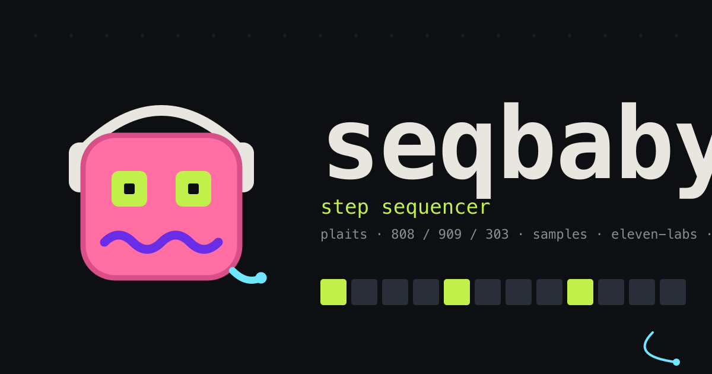

# seqbaby

<p align="center">
  
</p>

A multi-engine step sequencer that runs entirely in the browser. No installs, no
plugins: open a tab and build a track from synthesis engines, drum machines,
circuit models, wavetables, samples and live Web MIDI, then save it to your
account, share it as a link, jam on it with friends in real time, write it as
live code, or ask an agent to write parts of it for you.

**Live:** https://www.playseqbaby.com · **Manual:** https://www.playseqbaby.com/manual · **Repo:** https://github.com/mjoslyn/seqbaby

---

## What it is

A 32-pattern step sequencer with a deep per-track signal chain. Every track can
drive any of 50+ sound sources and carries its own filter (native or one of
eight analog-modeled characters), envelope, 5-band EQ, compressor with
sidechain, a reorderable 17-stage effect rack, an LFO matrix and per-step
automation. Patterns repeat or chain into songs, can be locked to their own
sound per pattern, bounced to WAV, played from the computer keyboard or driven
by vim keys, written as Strudel code, and saved to a Supabase-backed account
with a full version tree.

The audio engine is ~80 hand-written, dependency-free vanilla ES modules talking
to the Web Audio API, with no bundler: edit a file, reload. It is wrapped in a
thin **Next.js + React** shell that owns routing, auth, accounts, the public
site, sharing, the compose panel and the jam room. The two meet only through
`window.seqbaby`.

## Features

### Sound

- **Plaits**: a WebAssembly port of Mutable Instruments' Plaits oscillator, all
  16 synthesis models, with per-model tooltips on the four macro sliders.
- **Drum and synth recipes**: 808 / 909 kits, poly saw, FM bell and pad, built
  from Tone.js.
- **Twelve instruments modeled as AudioWorklets**, each written from the
  circuit or architecture up rather than as a preset, and each with a Node test
  suite that renders the processor and measures it:
  - **silverbox**: the acid box. 3-pole diode ladder, the accent RC network
    that stacks at high resonance, slides from tied steps.
  - **contagion**: a digital virtual-analog. Two multimode SVFs in series /
    parallel / split, a saturation stage between them, shape morph, two
    envelopes, 8-voice unison.
  - **hexop**: 6-operator FM with all 32 algorithms, decoded from Dexed's table,
    per-operator envelopes and presets.
  - **guitar** and **bass**: waveguide strings through pickup, amp, cab and (on
    the guitar) real speaker-to-string feedback. The bass adds parallel
    highpassed dirt, an always-on compressor, fret buzz and an octaver.
  - **subby**: a mono sub bass whose parallel harmonics path makes a 40Hz note
    audible on a phone speaker, with an 808 pitch drop and a band-split 303
    resonator above the crossover.
  - **drone**: a bytebeat (equation) oscillator into an MS-20 style filter, an
    eight-shape LFO, a delay that runs backwards and a granular cloud with
    freeze. Notes latch.
  - **vox**: a singing voice. A glottal pulse through five formants, consonants
    scripted before the vowel, a lyric typed in and sung a syllable a note
    (optionally read as English through CMUdict), and a choir of copies.
  - **lancet**: a snare synthesizer with seven models (analog, slap, modal,
    physical, fm, granular, blend), each carrying its own fx stage, plus a
    per-hit randomizer.
  - **siege**: the bass drum synth. A sine under a pitch envelope, with a
    wavefolder or clipper drive after the amplitude envelope, pitch lock and a
    gate mode that turns it into a bassline.
  - **ladder**: the transistor-ladder monosynth after the Minimoog: six waves
    and six ranges, a mixer that overloads the filter, the 4-pole feedback
    ladder with the saturator in its loop, two contours, the mod wheel, drift,
    and a mono mode with low-note priority.
  - **oracle**: the poly analog after the Prophet-6: two morphing VCOs with
    slop, a sub, noise, an ADSR, a drive on the summed voices and a stereo
    chorus, six voices.
- **Analog-mono pools** in Tone.js: *snarl*, *drift*, *tines*.
- **Wavetable** (bundled AKWF tables, in-app frame editor), **granular**
  (independent speed and pitch, modulatable grain controls) and a **unified
  sampler** (bundled 808 / 909 / acoustic kits or uploads, per-step region /
  fade / loop, slicing, pitch lock).
- **Web MIDI** out, and an **fx bus** engine: a track with no instrument that
  other tracks route through to share one filter, rack and mod matrix.
- An **instrument picker**: a searchable grid of every engine with group chips
  and preset cards, over the plain engine select.

### Per-track channel

```
voice → filter → eq → compressor → fx rack → master (or an fx bus) → limiter → out
```

- **Filter**: native lowpass / highpass / bandpass / notch, or eight analog
  characters (`fat`, `crisp`, `squelch`, `edge`, `poly`, `velvet`, `scream`,
  `growl`) built as ladder and SVF worklets with the saturator inside the
  feedback path. ADSR filter envelope.
- **EQ**: five bands. **Compressor**: self or sidechained from any track.
- **FX rack**, default order: gain → vinyl → cassette → fuzz → ring mod → wave
  shaper → crush → auto-wah → chorus → phaser → flanger → pitch shift → repeat
  → prism → pan → delay → reverb. The chain is the track's own: stages go on
  in the order you add them, can be dragged into a new order, and a stage can
  be added more than once with its own controls, LFOs and lanes.
  - The **crusher** is a converter model (fractional sample-and-hold clock plus
    quantiser, so it aliases like one).
  - The **reverb** is an 8-line feedback delay network whose decay is a
    coefficient, so it can be swept per step without re-rendering an impulse
    response.
  - The **prism** is a four-module console (character → movement → diffusion →
    texture → tilt), five characters per module, voiced to be stacked.
  - The **repeat** is a beat repeat and a live slicer clocked by the
    sequencer's own steps, so a repeat lines up across a jam.
- Engaged stages, active LFOs and non-default filter / EQ / comp settings show
  inline on the track as cards, so what a track is doing is visible without
  opening every panel.

### Sequencing

- 32 patterns per track, repeat or chain mode, per-pattern time signatures and
  repeat counts, immediate or end-of-bar switching.
- Per step: note, chord (scale-filtered, with inversions and strum), stacked
  piano-roll notes, arpeggiator, ratchet, velocity, micro-timing offset,
  length / ties.
- Per-track speed multiples (polymeter), swing, glide, drum-kit mode, and a
  copy / paste of a pattern between tracks.
- **p-lock**: lock a track's whole sound to one pattern, so the bass can sound
  different in the chorus while other patterns share the track's sound.
- **Euclidean generator**: Bjorklund proper, write-once or live, where live
  mode makes pulses / steps / rotate modulatable.
- **Chance generator**: a meloDICER-style part from probabilities, rhythm and
  pitch together, seeded so a saved song replays note for note.
- **Dice**: fill-level-aware random melodies.

### Modulation

- **LFOs** on ~280 targets: sine / triangle / saw / square, sample-and-hold
  random square, and a euclidean gate shape. Tempo sync, phase, unipolar or
  bipolar amount.
- **Automation lanes**: per-step values for ~280 targets, stored in the pattern.
  With record armed and the transport running, turning any knob writes its
  lane.
- **Macro pads**: XY pads whose axes drive parameters across tracks, momentary
  or latched, with a learn mode and a dice.
- One owner per parameter (LFO, lane or macro), enforced in every picker. A
  second needle on the knob shows where modulation has pushed the value right
  now.
- Right-click (long-press on touch) any parameter for its description, LFO,
  lane, macro assignment, reset, and how live code spells it.

### Live code

The `code` button opens a drawer with the song written as **Strudel**: every
sound is a track, mini-notation is read as a real pattern query (so `<a <b c>>`
and `hh*<2 4>` work), and ctrl/⌘-Enter runs the code into the running song
without stopping it. Constant controls set knobs, varying ones become
automation lanes, signals become synced LFOs, and seqbaby's own instruments and
controls have names of their own (`s("silverbox")`, `.knob()`, `.fx()`,
`.lfo()`, `.aut()`). The pattern bank is in the code as sections, p-lock is
`.lock()`, and a portable export opens on strudel.cc. No `eval`: a small parser
reads the JavaScript Strudel is written in, and whatever it cannot support is
listed rather than dropped.

### Playing and editing

- Rotary knobs over native range inputs, with relative drag and fine-trim; on a
  phone they become vertical sliders.
- Computer-keyboard performance mode (Ableton layout, scale mapping, chord
  mode), live record, step input with the transport stopped, and retroactive
  Capture of the last phrase.
- **Vim mode**: normal / insert / play / visual / command over the step cursor
  (`hjkl`, counts, `x o r dd yy p .`, `:k cutoff 0.4`, `:fx delay`), with a
  knob navigator that picks controls spatially and turns them from the
  trackpad.
- **Undo / redo** over the whole session (100 states, structurally shared),
  fed by watching the session rather than instrumenting every control, and
  restored onto the running engine without stopping it.
- In-browser **bounce** to 16-bit WAV, pattern or full song.
- A phone layout with labelled icon buttons, drill-down panels and a
  collapsing account bar.

### The public site

- **Homepage** (`/`): a toy sequencer, the songs people have published ranked
  by likes and freshness, who made them, and the newest public patches, each
  with a play button that drives the real engine in a hidden frame.
- **Explorers**: `/songs` (search, sort, filter by bpm and instruments),
  `/people` (filter by tempo, instruments and what they make) and `/patches`,
  all loaded once and filtered in the browser with the query in the URL.
- **Profiles** at `/u/<name>` with a 16x16 step-grid avatar you draw (or that
  your name generates), remix buttons, and hearts on songs and patches.
- A **manual** at `/manual` and a **bug page** at `/superbugs` that opens a
  GitHub issue without needing an account.
- Every song card draws the song's own steps, computed in Postgres on read;
  share links get an image card of the same steps.

### Accounts, sharing and collaboration

- **Cloud songs** with a **version tree**: every save appends a version, and
  saving from an older one branches instead of overwriting.
- **Templates**: mark a song as a template (and one as the default for `new`);
  the first save from it makes a new song.
- Auto-generated song names from what is in the session (`basement squelch`).
- A **patch bay**: a track's sound saved to your account, published to the
  gallery if you like, and saved from anyone else's card into your own bay.
- **Share links** (`?s=<slug>`) for published songs and anonymous quick shares,
  with link previews that name the song and who shared it.
- **Jam rooms** (`?jam=<room>`): several studios holding one song over Supabase
  Realtime. Edits travel as small diffs and merge into the running engine
  without stopping playback; a peer's edit is an undo step in their name and
  draws a border in their colour on the control they touched. Play presses
  land on a shared beat phase.
- **Compose panel**: ask for changes in words. A turn runs as a background job
  on the site's key (signed in) or your own Anthropic key (no account needed,
  never stored server-side). Its changes arrive in a review bar to
  **audition** into what is playing, **keep** (auto-saving a labelled version)
  or **discard**.

## Let an agent write one

The repo ships an [MCP server](mcp/README.md) (`npm run mcp`, or
`npx -y github:mjoslyn/seqbaby` with no clone) that exposes the song format as
36 tools: add a track, spell its rhythm as a step string (`x..X.o_.`), set its
sound, put an LFO on the filter, turn on a euclidean or chance generator, write
a part as Strudel code, audition it in headless Chromium and read the meters,
then export the JSON or post it for a share link. Every call is validated
against the same tables the engine uses, and refusals name the valid choices.
A `compose` skill (`.claude/skills/compose/SKILL.md`, also served as
`seqbaby://guide`) tells the agent which engine to reach for and how each likes
to be played. `.mcp.json` wires it up for Claude Code. The in-studio compose
panel runs the same tools.

## Tech stack

| Layer | Choice |
|---|---|
| Shell / routing / auth | Next.js 15 (App Router) + React 19 |
| Audio engine | Vanilla ES modules + Web Audio API + AudioWorklets, Tone.js 15 (vendored) |
| Synthesis | `@vectorsize/woscillators` (Plaits WASM) plus hand-written worklet DSP |
| Accounts + data | Supabase (Postgres, Auth, Row-Level Security, Realtime for jams) |
| Compose | Anthropic API, run in a Netlify background function |
| Anonymous sharing | Netlify Blobs (in-memory fallback in dev) |
| Agent tooling | MCP server over stdio, Playwright for auditions |
| Optional | PostHog analytics, Cloudflare Turnstile and a GitHub token for the bug page |
| Deploy | Netlify (`@netlify/plugin-nextjs`, Node 22); push to `main` deploys |

## Architecture

**Boot.** The studio route (`/studio`) server-renders the engine's static DOM
([`app/studioMarkup.ts`](./app/studioMarkup.ts)) and the engine script tags
([`app/EngineScripts.tsx`](./app/EngineScripts.tsx)): Tone → `woscillators.js` →
`js/main.js`. [`EnginePreload.tsx`](./app/EnginePreload.tsx) emits
`modulepreload` hints for every module so the 8-deep import graph arrives in
parallel, and a raw-markup [preloader](./app/Preloader.tsx) with measured
progress covers the gap. On a client-side navigation
[`ScriptLoader.tsx`](./app/ScriptLoader.tsx) injects the same scripts in order.
Production deploys publish engine assets under a per-commit path
(`public/e/<sha>/`) so they can be cached as immutable.

**Engine.** A single `Tone.getTransport().scheduleRepeat` at a 16th-note grid
drives everything. Each tick, every track advances by its own speed, runs its
automation, asks `stepSource.js` what the step plays (written pattern, euclid
ring or chance generator), expands chords and arps, applies swing and
micro-timing, fires the filter envelope and triggers its voice. Voices share one
interface (`hit / setParam / getAudioParam / setEngine / getOutputNode /
silence / dispose`), so transport, modulation and UI stay engine-agnostic. The
worklet instruments and the worklet fx stages (crusher, reverb, prism, repeat,
the analog filter models) all follow one file shape: the processor source as a
string, registered from a Blob URL, with a Tone.js fallback so a track is never
silent.

**Session format.** `serializeSet` / `applySet` (session.js) are the song. One
more path writes that same format onto a running engine without stopping it:
`mergeSet` (liveSet.js), shared by undo, the compose audition, jam patches and
the code drawer. The format's tables and validators (`engineData.js`,
`soundDefaults.js`, `theoryData.js`, `constants.js`, `sessionFormat.js`,
`chanceGen.js`, `historyStore.js`, `jamSync.js`, `songBuilder.js`,
`miniNotation.js`, `strudel.js`) import nothing browser-side, which is what
lets `node --test` and the MCP server run them. The same goes for each worklet
processor, which is why the engines have measured tests rather than described
behaviour.

**Shell.** Supabase server actions under `app/*/actions.ts` handle songs,
versions, templates, patches, profiles and accounts; the public feeds
(`app/home/feed.ts`, `app/songs/exploreFeed.ts`, `app/people/peopleFeed.ts`)
read with an anonymous client so the pages stay cached. `middleware.ts`
refreshes the auth session on every request except engine assets. The compose
panel (`ComposeChat.tsx`), jam room (`JamPanel.tsx`) and patch bay
(`PatchBay.tsx`) talk to the engine only through `window.seqbaby` (typed in
`app/seqbaby.d.ts`).

See [`CLAUDE.md`](./CLAUDE.md) for the detailed tour: module map, data model,
each engine's design notes, timing rules and the load-bearing audio-unlock
behaviour.

## Running locally

```bash
npm install
npm run dev          # Next.js dev server → http://localhost:3000 (studio at /studio)
```

The engine itself needs no env, but the Next pages need a Supabase URL and anon
key to render at all: copy `.env.example` and set `NEXT_PUBLIC_SUPABASE_URL`
and `NEXT_PUBLIC_SUPABASE_ANON_KEY` (any syntactically valid pair gets the
studio up without a project; account features then fail and the studio plays).
Compose on the site's key needs `ANTHROPIC_API_KEY`; with your own key pasted
into the panel it needs nothing. PostHog, Turnstile and the bug page's GitHub
token are optional and off when unset.

```bash
npm run build && npm run start   # production build + serve
npm run netlify:dev              # full Netlify emulation (functions + Next) on :8888
npm run legacy:dev               # pre-Next static Node server on :5173 (engine only)
npm test                         # node --test over the pure engine modules, every worklet, and lib/
npm run test:rls                 # Supabase RLS policy tests in a throwaway Postgres (docker)
npm run mcp                      # the MCP server on stdio
```

The engine has no build step: edit files under `public/js/` and reload. The
React shell hot-reloads via `next dev`. Adding a module to `public/js/` means
adding it to the preload list in `app/engineAssets.ts` (the file's comment has
the one-liner).

## Project layout

```
app/                         Next.js App Router: shell, auth, account UI, public site, server actions
  page.tsx + home/           the homepage: toy sequencer, feed, people, patches, ranking
  studio/page.tsx            the studio at /studio: SSRs engine DOM, boots engine, AccountBar
  songs/ people/ patches/    the explorers, their pure filter/sort modules, and the songs/patches actions
  manual/ superbugs/         the manual, and the bug page that opens a GitHub issue
  login/ settings/ u/[username]/ reset-password/   auth, settings (profile, avatar editor, patch manager), profiles
  studioMarkup.ts            the engine's static DOM skeleton (hexop/guitar/.../oracle panels generated)
  EngineScripts / EnginePreload / ScriptLoader / Preloader   engine boot
  AccountBar / SongsMenu / SaveButton / PatchBay / NewSongButton / VersionTree / LikeButton / RemixButton
  ComposeChat.tsx            the compose panel and its review bar
  JamPanel.tsx               jam room: presence, Realtime channel, invite link
  enginePlayer.ts + PlayButton.tsx   play a listed song with the real engine in a hidden frame
  shareCard.ts + shareCopy.js + api/og/   link previews and their image cards
  api/share/  api/patch/[id]/  api/compose/  api/bugs/   share endpoint, patch config, compose job + status, bug reports
  {songs,patches,profile,auth,account}/actions.ts   Supabase server actions
public/
  js/                        the engine: ~80 dependency-free ES modules (12 worklet instruments,
                             4 worklet fx stages, the filter models, the Strudel reader, the song builder)
  js/data/cmudict.txt        the vox's pronouncing dictionary, fetched on demand
  tone.js  woscillators.js   vendored Tone.js, Plaits WASM port
  samples/                   the acoustic kits (salamander, virtuosity, drskit)
  wavetables/akwf/           bundled AKWF wavetables (CC0)
  style.css  icons/  manifest.webmanifest
lib/
  supabase/                  Supabase SSR helpers
  composeModels / composeKey / composeJobs   compose model, key handling, jobs + limits
  jamWire.js                 splits jam messages to fit the broadcast cap
  api.js                     legacy Netlify Blobs share store
mcp/                         MCP server, tool definitions, the compose turn loop, headless audition
netlify/functions/           compose-background worker, legacy share wrapper
supabase/migrations/         profiles, songs, patches, versions, templates, chats, previews, likes, avatars
supabase/tests/              negative RLS tests
scripts/                     asset stamping, app icons, drum kit rendering, the vox dictionary, RLS runner
test/                        node --test suites (format, generators, every worklet, Strudel, the explorers)
.claude/skills/              compose (the agent's guide) and verify (driving the app to check a change)
```

## Known limitations

- Undo is in memory and per page, capped at 100 states.
- LFOs on pooled voices (Plaits and the Tone.js analog pools) reach the first
  voice only; the worklet engines modulate the whole instrument.
- Bounce is real-time capture; offline rendering would need the voices rebuilt
  under an `OfflineAudioContext`, which the Plaits WASM voice doesn't support.
- Keyboard performance mode, vim mode and knob recording are desktop-only.
- Jam members share which step plays, not a sample clock.
- Safari reports no output latency, so visuals use an estimate (`?vlat=` to
  calibrate).

## Credits & license

Personal project. Plaits synthesis models originate from Mutable Instruments
(open-source hardware); Tone.js is MIT-licensed. The hexop's algorithm table is
decoded from Dexed (Apache 2.0). The bundled wavetables are from
[AKWF, Adventure Kid Waveforms](https://github.com/KristofferKarlAxelEkstrand/AKWF-FREE)
by Kristoffer Karl Axel Ekstrand, released under CC0-1.0 (see
[`public/wavetables/akwf/ATTRIBUTION.md`](./public/wavetables/akwf/ATTRIBUTION.md)).
The acoustic drum kits are rendered from Salamander (CC BY-SA 3.0), Virtuosity
(CC0) and DRSKit (CC BY 4.0); `scripts/make-drum-kits.mjs` records which file
each hit came from. The vox's pronouncing dictionary is CMUdict (BSD), with its
notice at the top of `public/js/data/cmudict.txt`.
